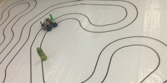
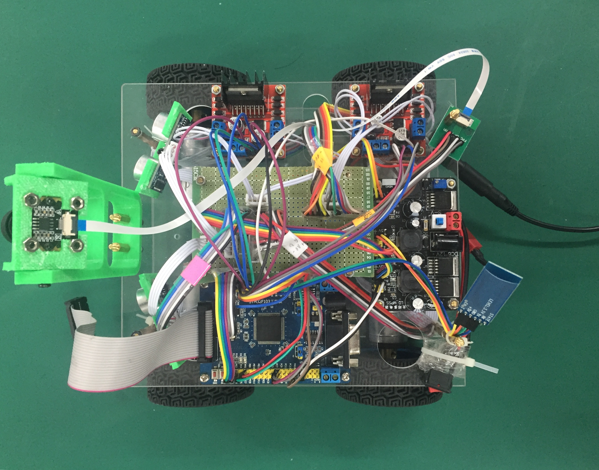

# Smart cart
Rui Wang

### This project is for course Mechatronics Systems Lab 2018 spring, offered by Dpt. O'MechE at Tsinghua University.



A link to the video of the cart running is available [here](https://youtu.be/E4SRxa9p3hk).

## Basic Information
**Goal**: 

A cart that

* can track a double-lined lane
* can avoid obstacles.
* drives as fast as it can

**Basic Config**:

* [STM32 standard peripheral library](http://stm32.kosyak.info/doc/) 
* Keil mdk as IDE (only on Windows)
* linear CCD for lane detection
* ultrasonic radar for obstacle detection
* unbalanced velocity for cart turns
* remote control module with Wifi
* offline programming

## Disclaimer
Generally it is recommended to use HAL library, while standard peripheral library is no longer supported by the official ST. With CubeMX and HAL lib, things will be much easier. There are loads more English docs on websites and it also works on Mac. However, due to the course reqs, I had to use the STP3.5 library.

Also, not every link provided here works fine. They are just references and it is highly recommended to get the idea and implement your own code. My code, however, is guaranteed to work on my own hardware settings.

## Design Overview



The overall design of the cart is shown above. It mainly consists of mechanical parts, circuits and software.

## Mechanical Design
Here is the general design of the cart.

Mechanical structures can be found in ```/parts_solidoworks```. The upper and lower board of the cart were laser-cut and other parts were 3D-printed.

## Circuit Configuration
Circuit config will be uploaded shortly.

## Tests
Here a list of basic information about standard peripherals used on STM32 are listed.

### ENCODER MODE TEST - for cart velocity measurement

The basic idea is to utilize timer `encoder mode` (which counts numbers), and have `systick` exception every thrown 50ms (or other values) to calculate the current velocity. Note that `Systick` here is integrated on Cortex system, not offered by ST.

**A list of useful resources:**

* [Redirect `printf()` to Keil debug screen with JLink](https://www.douban.com/note/248637026/)
* [Motor parameters on taobao.com, offered in Chinese](https://item.taobao.com/item.htm?spm=a230r.1.14.19.3b516d0aHPEsqs&id=533000737918&ns=1&abbucket=5#detail)
* According to my measurement, for this encoder, each rotation cycle has 11 counts.
* [One example for STM32 timer encoder mode usage](https://github.com/xiahouzuoxin/notes/blob/master/essays/STM32%E7%94%A8%E4%BD%9C%E7%BC%96%E7%A0%81%E5%99%A8%E6%8E%A5%E5%8F%A3%E7%9A%84%E5%8E%9F%E7%90%86.md)
* [The official reference for `systick`](https://www.keil.com/pack/doc/CMSIS/Core/html/group__SysTick__gr.html#gabe47de40e9b0ad465b752297a9d9f427)

Redirecting `printf()` to screen is extremely useful here as the debugger in Keil cannot display values real-time for some variables that are changing as fast as the _velocity_ here.

### TIME INTERVAL TEST - for velocity measurement
Due to the limited pins offered by the boarder vendor, I have to find another way of measuring velocity apart from the orthogonal encoder mode. The idea is to use the capture mode and measure the total time interval between several impulses brought by one pin of the encoder. In my implementation, an interrupt will generate every 4 times the encoder crosses a spoke.

**A list of useful resources:**

* [for timer1 and 8, the interrupt process is different from general timers](https://blog.csdn.net/qq_14997473/article/details/46942927)
* [timer interrupt config overview and explanation, without GPIO input](https://blog.csdn.net/longintchar/article/details/43453393)
* [an example of timer interrupt with GPIO input as capture source](https://blog.csdn.net/mvp_dong/article/details/43120533)

**Important tips:**

* Syntax: we use GPIO_Pin1 | GPIO_Pin2 to represent both pins are used. However, for `NVIC` and `TIM_Channel`, this is not the case. When we want to config multiple interruptions or multiple channels of one timer, we have to config each one separately. Refer to my code on this point.
* `TIM8_UP_IRQHandler()` is carried out each time `TIM8->CNT` reloads. This function here specifically determines if a long time has passed and no interrupts happen (meaning, the cart velocity is very slow). In such case, it will assign $v = 0$ arbitrarily because otherwise, the velocity is not getting updated and will keep its previous value even when it is actually 0.

**Problems**

* So when the velocity reverses direction, I found that the time interval method will return a very large value from time to time. I deduce that this is caused by motor joggling and cannot be solved with this method. So we will simply get rid of unreasonable values.
* The mean value filter, under the condition that the cart is very slow, will result in a major delay in velocity calculation. Therefore, we opt not to use the mean value filter in the end after several tests.
* When the velocity calculated by two methods differ too much, should use the encoder mode as the standard.

### ULTRASONIC MODULE TEST
We use an ultrasonic module **HC-SR04** to check if there is an obstacle nearby. The ultrasonic module emits a wave when the pin TRIGGER is high for >10 us. The pin ECHO receives a high for a time t, meaning that the time sound travelled was t.

We trigger a timer to record time when rising edge is detected, and stop recording when falling edge is detected.

There are two things worth noting here. First, since there are two ultrasonic modules and we need to know whether the obstacle is on the left side or the right side, a little logistic is needed. We need some flags to mark if it is the left, right or no ultrasonic module that has detected an obstacle within a certain distance. Once we detected an obstacle, we will record the current state in a global variable for our control algorithm to recognize.

Second, different from most examples found online, in our implementation we are not interested in exactly how far away the obstacle is. Rather, we are concerned about whether that distance exceeds a specific _threshold_. For example, let us set the threshold at 50cm. Now the simplest way is when we configure our timer, we let it have a period that accords with a distance of 50cm. Now if the timer ever experiences reloading during a trigger-and-echo process, the distance can directly be determined to be above that threshold. Therefore, there is no need to do extra calculation, which saves our time.

An example: timer prescaler = 72.

72000000 / 72 = 1000000, 1ms = 1000 counts. period = 3000

This will result in a rough distance threshold of 510mm.

**A list of useful resources:**

* [neat code, but not good implementation in that the author did not use interrupt, but wait until signal comes. Not suitable in our case.](https://blog.csdn.net/zhangdaxia2/article/details/50783566)
* [Used interruption mechanism, but there are some minor unnecessities in code.](https://blog.csdn.net/tcjy1000/article/details/70170058)


**Important tips:**

* the ultrasonic module must be connected to a voltage source of 5V, not 3.3V! Otherwise there might be weird problems such as a lot of wrong rising edges on the ECHO pin.
* The time interval between 2 trigger should be longer than 60ms. Otherwise, the echos and triggers will overlap and it is impossible to distinguish which echo is paired with which trigger.

## Linear CCD

A linear CCD returns 128 pixels on a line. The voltage of each pixel represents the brightness of a particular point, therefore indicating whether it is a black line or a white surface. This allows us to determine where the cart is relative to the center of the lane. In our implementation, linear CCD utilizes the ADC module on STM32.

In order for us to track the double lines, it is important to make sure both lines are under tracking even when they are not in sight (for example, at a sharp turning, we will not be able to see one line).

**Important tips:**

* The linear CCD takes around 10 ms of exposure time. If it takes shorter time, we may need to use DMA instead of CPU to transmit data. Otherwise, it is taking up too much of the CPU resources.
* Since CCD takes around 3 ms to transmit all the data, it should be interrupted when other events happen (such as velocity calculation).

## Motor PID Controller

The motor controller is basically a PID controller that converges the motor velocity to target velocity. It is a small feedback loop within the large feedback loop introduced in the next section.

I implemented a "increment PID" which, based on the idea to discretize the consecutive PID, utilizes the previous frame of input u (which is pwm `pulse` value for STM32 timer) and adds an increment to it.

A consecutive PID is

$$ u_t = k_p \epsilon_t + k_i \int_0^t \epsilon_t + k_d \dot{\epsilon_t} $$

Discretize and subtract $u_t$ by $u_{t - 1}$, we obtain

$$\Delta u_n = k_p(\epsilon_n - \epsilon_{n - 1}) + k_i\Delta t \epsilon_n + \frac{k_d}{\Delta t}(\epsilon_n - 2\epsilon_{n - 1} + \epsilon_{n - 2}) $$

Note that we can take $k_i\Delta t$ and $\frac{k_d}{\Delta t}$ as two coefficients $k_i'$ and $k_d'$ since $\Delta t$ is a constant. The expression above is used to update pwm duty cycle.

## General Controller

The general controller goes like the block diagram shown below:
!!!TO BE COMPLETED!!!

**Paramter Tuning**
1. D is small
2. 

## Some thoughts

* The controller turns out to be very robust. Even though the motor controller is not tuned perfect, and one of our motor is slightly broken, the cart is still running relatively well. This is because PID utilizes feedback and does not rely heavily on the model of the car.
* Becasue CCD returns 128 values, the resolution is high enough for us to use a PID controller. If, for example, infrared sensors are used, the resolution will be much lower (4~6), and the cart will not be able to know where exactly it is relative to the lane. The result of the infrared sensor cannot be used in a PID controller.

## List of files under  /USER
```
retarget.c     for prinft() redirection
motor_test.c   for motor test
```